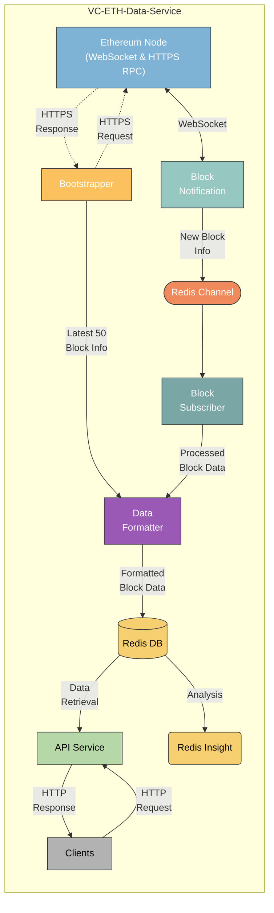

# VC-Ethereum Data Service Architecture

The pivotal decision in our architecture aimed at storing information for the most recent 50 blocks centers around our database choice. Given the project's scope and requirements detailed [here](https://github.com/srinathln7/ethereum-data-service/blob/main/docs/CHALLENGE.md), Redis was selected as our local store. The rationale behind this decision is thoroughly outlined [here](https://github.com/srinathln7/ethereum-data-service/blob/main/docs/REDIS.md).

## Overall Flow of VC-Ethereum Data Service Architecture

The VC-Ethereum Data Service architecture streamlines the retrieval, processing, and distribution of Ethereum blockchain data through these components:

**Ethereum Node**
- **Role**: Primary interface to the Ethereum blockchain, providing real-time updates via WebSocket and historical data (most recent 50 blocks) via HTTPS RPC.
- **Documentation**: For more details on different JSON RPC calls supported, please refer to the [Ethereum JSON-RPC](https://ethereum.org/en/developers/docs/apis/json-rpc/).

**Bootstrapper**
- **Role**: Retrieves historical block data from the Ethereum Node using HTTPS RPC.
- **Flow**: Initiates an HTTPS request to fetch the latest 50 blocks for initial synchronization.
- **Documentation**: For more details, please refer to the [bootstrapper README](https://github.com/srinathln7/ethereum-data-service/tree/main/internal/services/bootstrapper).

**Block Notification**
- **Role**: Listens for new blocks in real-time via WebSocket subscription from the Ethereum Node.
- **Flow**: Establishes a bi-directional WebSocket connection to receive immediate updates on new blocks.
- **Documentation**: For more details, please refer to the [pub README](https://github.com/srinathln7/ethereum-data-service/tree/main/internal/services/pub).

**Redis Channel**
- **Role**: Event-driven message broker facilitating asynchronous communication.
- **Flow**: Receives new block information from Block Notification and forwards it to downstream components.

**Block Subscriber**
- **Role**: Subscribes to the Redis Channel to process incoming block data.
- **Flow**: Listens to the Redis Channel, processes block updates, and prepares data for further handling.
- **Documentation**: For more details, please refer to the [sub README](https://github.com/srinathln7/ethereum-data-service/tree/main/internal/services/sub).

**Data Formatter**
- **Role**: Formats raw block data into a structured format using `model.Data` struct definitions.
- **Integration**: Modular integration into Bootstrapper and Block Subscriber ensures consistent data formatting before storage.
- **Documentation**: For more details, please refer to the [model README](https://github.com/srinathln7/ethereum-data-service/tree/main/internal/model).

**Redis DB**
- **Role**: Central storage for processed Ethereum blockchain data.
- **Flow**: Stores formatted block data received from Data Formatter and Block Subscriber, enabling efficient data retrieval.
- **Documentation**: For more details, please refer to the [storage README](https://github.com/srinathln7/ethereum-data-service/tree/main/internal/storage).

**API Service**
- **Role**: External interface for clients to query Ethereum blockchain data.
- **Flow**: Receives HTTP requests, retrieves requested data from Redis DB, and returns HTTP responses containing queried blockchain data.
- **Documentation**: For more details, please refer to the [v1 README](https://github.com/srinathln7/ethereum-data-service/tree/main/api/v1).

**Clients**
- **Role**: External consumers accessing Ethereum blockchain data.
- **Flow**: Initiates HTTP requests to API Service to fetch specific blockchain data of interest.

**Redis Insight**
- **Role**: Analyzes and visualizes data stored in Redis DB, offering insights into key creation and memory usage.
- **Flow**: Provides real-time GUI monitoring of Redis operations, complementing `redis-cli`.

## Remark

The `Data Formatter` module integrates as a component rather than a standalone service, ensuring uniform data formatting across Bootstrapper and Block Subscriber. This approach maximizes code reuse and data integrity within the VC-Ethereum Data Service architecture.

Overall, this design strives to efficiently combine real-time and historical Ethereum data processing, leveraging Redis for both message brokering and data storage. The API Service ensures that clients have quick and reliable access to the latest blockchain data.
