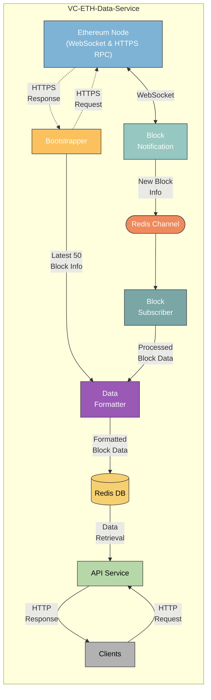

# VC-Ethereum Data Service Architecture

## Overview

This document describes the architecture of the Ethereum Data Service, which processes and serves Ethereum blockchain data. The service leverages both WebSocket and HTTPS RPC connections to an Ethereum node, processes the data, and makes it available via an API to clients.

## Components and Data Flow

### Ethereum Node
**Role:** Acts as the primary gateway to the Ethereum blockchain.
**Connections:** Provides data through both WebSocket (real-time updates) and HTTPS RPC (historical data retrieval) endpoints.

### Block Notification
**Role:** Listens for new block events from the Ethereum Node using WebSocket.
**Flow:** Bi-directional WebSocket connection with the Ethereum Node for real-time block updates.
**Data:** Forwards new block information to the Redis Channel for further processing.

### Bootstrapper
**Role:** Retrieves historical block data from the Ethereum Node.
**Flow:** Uses HTTPS RPC to request and retrieve the latest 50 blocks from the Ethereum blockchain.
**Data:** Directly loads the retrieved block data into the Data Formatter for processing.

### Data Formatter
**Role:** Transforms raw block data into a structured format according to the required data model as per struct defined in `model.Data`.
**Flow:** Receives block information from both the Bootstrapper (latest 50 blocks) and Block Subscriber (real-time blocks).
**Data:** Processes and formats the block data before loading it into RedisDB.

### Redis Channel
**Role:** Acts as a message broker for asynchronous communication.
**Flow:** Receives new block information from the Block Notification service.
**Data:** Forwards block data to the Block Subscriber for processing.

### Block Subscriber
**Role:** Subscribes to the Redis Channel to process incoming block data.
**Flow:** Receives and processes block data updates from the Redis Channel.
**Data:** Stores the processed block data into RedisDB for retrieval.

### Redis DB
**Role:** Central storage for processed Ethereum blockchain data.
**Flow:** Stores processed block data received from both the Data Formatter (formatted blocks) and Block Subscriber (processed blocks).
**Data Retrieval:** Serves stored data to the API Service for client requests.

### API Service
**Role:** Provides an interface for clients to access Ethereum blockchain data.
**Flow:** Handles HTTP requests from clients and retrieves requested data from Redis DB.
**Data Exchange:** Sends HTTP responses with the requested Ethereum blockchain data to clients.

### Clients
**Role:** Consumers of the Ethereum Data Service.
**Flow:** Make HTTP requests to the API Service to retrieve Ethereum blockchain data.
**Data Exchange:** Receive HTTP responses containing the requested blockchain data from the API Service.

This design efficiently combines real-time and historical Ethereum data processing, leveraging Redis for both message brokering and data storage. The API Service ensures that clients have quick and reliable access to the latest blockchain data. 
