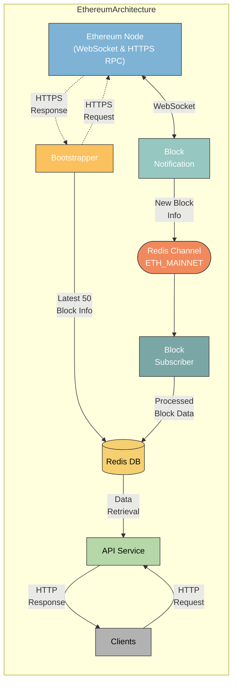

### DESIGN.md

# VC-Ethereum Data Service Architecture

## Overview

This document describes the architecture of the Ethereum Data Service, which processes and serves Ethereum blockchain data. The service leverages both WebSocket and HTTPS RPC connections to an Ethereum node, processes the data, and makes it available via an API to clients.

## Components and Data Flow

### Ethereum Node
- **Role:** Acts as the source of Ethereum blockchain data.
- **Connections:** Provides data through both WebSocket and HTTPS RPC endpoints.

### Block Notification
- **Role:** Listens for new blocks in real-time using a WebSocket subscription to the Ethereum node.
- **Flow:** Establishes a bi-directional WebSocket connection with the Ethereum node to receive real-time updates.
- **Data:** Sends new block information to the Redis Channel.

### Bootstrapper
- **Role:** Retrieves the most recent 50 block data from the Ethereum node at the time of starting the process.
- **Flow:** Uses an HTTPS RPC endpoint to request the latest 50 blocks from the Ethereum node.
- **Data:** Directly loads the retrieved block data into Redis DB.

### Redis Channel (ETH_MAINNET)
- **Role:** Acts as a message broker to handle event-driven asynchronous communication.
- **Flow:** Receives new block info from the Block Notification service and forwards it to the Block Subscriber.

### Block Subscriber
- **Role:** Processes new block information received from the Redis Channel.
- **Flow:** Subscribes to the Redis Channel to receive updates and processes the block data.
- **Data:** Stores the processed block data into Redis DB.

### Redis DB
- **Role:**  Central storage for processed block data with a predetermined expiration time.
- **Flow:** Receives block data from both the Bootstrapper (historical data) and Block Subscriber (real-time data).
- **Data Retrieval:** Serves processed data to the API Service.

### API Service
- **Role:** Provides a simple HTTP API interface for clients to access the processed Ethereum data.
- **Flow:** Retrieves data from Redis DB based on client requests.
- **Data Exchange:** Handles HTTP requests and responses with clients.

### Clients
- **Role:** Consumers of the Ethereum data service.
- **Flow:** Make HTTP requests to the API Service to retrieve Ethereum data.
- **Data Exchange:** Receives HTTP responses with the requested data.

This design efficiently combines real-time and historical Ethereum data processing, leveraging Redis for both message brokering and data storage. The API Service ensures that clients have quick and reliable access to the latest blockchain data. 
