# Ethereum Data Service

## Proposed Architecture

```mermaid
graph LR
    A[Ethereum Node<br>WebSocket API]
    B[Block Subscriber]
    C[Block Processor]
    D[Redis Circular Queue<br>Latest 50 Blocks]
    E[API Service]
    F[Clients]

    A -->|WebSocket Subscription| B
    B -->|New Block Notifications| C
    C -->|Processed Block Data| D
    D -->|Data Retrieval| E
    E -->|HTTP Requests/Responses| F

    style A fill:#f9f,stroke:#333,stroke-width:2px
    style B fill:#bbf,stroke:#333,stroke-width:2px
    style C fill:#bfb,stroke:#333,stroke-width:2px
    style D fill:#fbf,stroke:#333,stroke-width:2px
    style E fill:#ff9,stroke:#333,stroke-width:2px
    style F fill:#f99,stroke:#333,stroke-width:2px
```



## Proposed Project Structure

Your proposed project structure looks well-organized and modular, adhering to best practices in Go project organization. It provides a clear separation of concerns, which will make your codebase maintainable and scalable. Here's a brief overview of each component and why it's appropriate:

### Project Structure Overview

```ethereum-data-service/
│
├── cmd/
│   └── server/
│       └── main.go
│
├── internal/
│   ├── api/
│   │   └── handlers.go
│   │
│   ├── config/
│   │   └── config.go
│   │
│   ├── models/
│   │   ├── block.go
│   │   ├── transaction.go
│   │   └── event.go
│   │
│   ├── service/
│   │   ├── block_service.go
│   │   ├── transaction_service.go
│   │   └── event_service.go
│   │
│   └── storage/
│       ├── redis.go
│       └── circular_queue.go
│
├── pkg/
│   ├── logger/
│   │   └── logger.go
│   │
│   └── utils/
│       └── utils.go
│
├── Dockerfile
├── docker-compose.yml
├── go.mod
├── go.sum
└── README.md

```

### Detailed Breakdown

- **cmd/server/main.go**: Entry point for the application, responsible for initializing and starting the server.
  
- **internal/**: Contains application-specific code that isn't meant to be imported by other projects.
  
  - **api/**: Handles HTTP routes and middleware.
    - `handlers.go`: Contains the HTTP handler functions.
    
  
  - **blockchain/**: Interfaces with the Ethereum blockchain.
    - `client.go`: Ethereum client setup and configuration.
    - `subscriber.go`: Subscribes to new block events.
    - `processor.go`: Processes block data, transactions, and events.
  
  - **config/**: Configuration handling.
    - `config.go`: Loads and manages configuration settings.
  
  - **models/**: Defines data models.
    - `block.go`: Block data model.
    - `transaction.go`: Transaction data model.
    - `event.go`: Event data model.
  
  - **storage/**: Interfaces with the data store.
    - `redis.go`: Redis client setup and interactions.
    - `circular_queue.go`: Implementation of the circular queue for storing blocks.
  
  - **service/**: Business logic and service layer.
    - `block_service.go`: Business logic for handling block-related operations.
    - `transaction_service.go`: Business logic for handling transaction-related operations.
    - `event_service.go`: Business logic for handling event-related operations.
  
- **pkg/**: Contains utility packages that can be used across different projects.
  - `logger.go`: Centralized logging functionality.
  - `utils.go`: Utility functions.
  
- **scripts/**: Scripts for setup and maintenance.
  - `setup.sh`: Script to set up the environment or dependencies.
  
- **tests/**: Contains unit and integration tests.
  - `integration/api_test.go`: Integration tests for the API.
  - `unit/blockchain_test.go`: Unit tests for blockchain interactions.
  - `unit/storage_test.go`: Unit tests for storage interactions.
  
- **Dockerfile**: Defines the Docker image.
- **docker-compose.yml**: Docker Compose file for setting up the application stack.
- **go.mod**: Go module file.
- **go.sum**: Go dependencies checksum file.
- **README.md**: Documentation and instructions for the project.


# References

* [Ethereum JSON-RPC Specification](https://ethereum.github.io/execution-apis/api-documentation/)

* [Ethereum-Block-Explorer](https://blockexplorer.one/ethereum/mainnet)